# data-engineering-mvp
Minimal viable product do curso de engenharia de dados da PUC-Rio

# 📊🎬 **Minimal viable product: Pipeline de preparação de dados para análise de avaliação de filmes e demais dados.**

## 🚀 **Sprint: Engenharia de dados**  

**Aluno:** Rafael Henrique da Costa  
**RA:** 4052025002012  
**Turma:** 40530010002_20260_01

## Objetivo

O objetivo desse MVP é preparar a base do IMDb para possibilitar análises consistentes das avaliações de filmes e de suas principais características, considerando apenas os títulos que atendem aos critérios definidos durante o processo de tratamento e curadoria da base.

## Perguntas a serem respondidas

**1- Quantos filmes possuem avaliação?**  

**2- Qual a nota média geral dos filmes?**

**3- Qual o filme mais bem avaliado?**

**4- Qual o filme com maior número de votos?**

**5- Quantos filmes têm nota acima de 8?**

**6- Quantos filmes têm menos de 100 votos?**

**7- Qual a distribuição das notas médias?**

**8- Top 10 filmes mais bem avaliados (mínimo X votos)**

**9- Top 10 filmes com mais votos**

**10- Filmes “cult”: nota alta, poucos votos**

**11- Filmes “populares”: muitos votos, nota mediana**

**12- Quais filmes Christopher Nolan dirigiu?**

**13- Quantos filmes cada diretor dirigiu?**

**14- Quais os 5 filmes mais bem avaliados do Christopher Nolan?**

## Detalhamento

### **1- Busca pelos dados**  
Os dados foram obtidos no portal oficial da base de dados do IMDb (https://datasets.imdbws.com/). Os arquivos utilizado foram:
- **name.basics.tsv.gz**: possui dados básicos de cada pessoa.
- **title.basics.tsv.gz**: possui dados básicos de filmes, documentários, programas de TV.
- **title.principals.tsv.gz**: possui dados de quais são os integrantes principais (diretor, fotógrafo, etc...)
- **title.ratings.tsv.gz**: possui dados de nota média e quantidade de votos de cada filme, documentário, programa de TV.

### **2- Coleta**

Os dados foram coletados e armazenados em um bucket S3 diretamente na plataforma da Amazon AWS. Posteriormente foi feito a conexão entre a conta Databricks e a plataforma Amazon AWS para manipular os dados utilizando o Apache Spark. Para isso, foi necessário configurar parâmetros de acesso e autênticação entre as plataformas e obter as chaves de acesso para conseguir o devido acesso ao armazenamento em nuvem da Amazon AWS.

### **3- Modelagem**
O esquema utilizado foi o Estrela com fato e dimensões:

**Fato**: Avaliação de filmes (fact_movies_ratings)  
**Dimensões**: Filmes e pessoas (dim_movie, dim_person)

### **Catálogo de dados - Data Warehouse de Avaliações de Filmes**

**Tabela Fato: fact_movies_ratings**

📌 Descrição

Tabela fato que armazena métricas agregadas de avaliação por filme.
Cada linha representa um filme com sua nota média e quantidade total de votos.

🎯 Grão (Granularidade)

1 linha por filme (tconst)

🔑 Chave Primária

tconst

🔗 Chaves Estrangeiras

tconst → dim_movie.tconst

📊 **Métricas**

| Coluna           | Tipo   | Descrição                           |
| ---------------- | ------ | ----------------------------------- |
| `averageRatings` | DOUBLE | Nota média do filme (escala 0–10)   |
| `numVotes`       | INT    | Quantidade total de votos recebidos |

📈 **Exemplos de Perguntas Respondidas**

Quais são os filmes mais bem avaliados?

Qual a distribuição das notas médias?

Qual o filme mais bem avaliado (desempate por votos)?

Qual a média global das avaliações?

  

**Dimensão: dim_movie**
📌 Descrição

Dimensão que armazena informações descritivas dos filmes.

🎯 Grão

1 linha por filme (tconst)

🔑 Chave Primária

- tconst

📊 **Métricas**

| Coluna           | Tipo   | Descrição                    |
| ---------------- | ------ | ---------------------------- |
| `tconst`         | STRING | Identificador único do filme |
| `primaryTitle`   | STRING | Título principal do filme    |
| `originalTitle`  | STRING | Título original              |
| `startYear`      | INT    | Ano de lançamento            |
| `runtimeMinutes` | INT    | Duração do filme em minutos  |
| `genres`         | STRING | Gêneros do filme             |

📈 Exemplos de Perguntas Respondidas

**Filmes lançados por ano**

**Filmes por gênero**

**Filmes mais bem avaliados com título e ano**

**Análise histórica de avaliações**

 

**Dimensão: dim_person**

📌 Descrição

Dimensão que contém informações básicas das pessoas envolvidas nos filmes (diretores, atores, etc.).

🎯 Grão

1 linha por pessoa (nconst)

🔑 Chave Primária

- nconst

📊 **Métricas**
| Coluna        | Tipo   | Descrição                             |
| ------------- | ------ | ------------------------------------- |
| `nconst`      | STRING | Identificador único da pessoa         |
| `primaryName` | STRING | Nome principal                        |
| `birthYear`   | INT    | Ano de nascimento                     |
| `deathYear`   | INT    | Ano de falecimento (quando aplicável) |

📈 Exemplos de Perguntas Respondidas

**Quantos filmes cada diretor dirigiu**

**Filmes associados a uma pessoa**

**Ranking de diretores por quantidade de filmes**

**Ranking de diretores por avaliação média**

 

**Tabela ponte: bridge_movie_person**
| Coluna     | Descrição                              |
| ---------- | -------------------------------------- |
| `tconst`   | Filme                                  |
| `nconst`   | Pessoa                                 |
| `category` | Papel no filme (director, actor, etc.) |

### 4- Carga

O pipeline de dados deste projeto foi estruturado seguindo a arquitetura Medallion (Bronze, Silver e Gold), amplamente utilizada em ambientes de Data Lakehouse, com o objetivo de garantir qualidade, rastreabilidade, escalabilidade e clareza analítica ao longo do processamento.

🔹 **Camada Bronze — Ingestão dos Dados Brutos**

A camada Bronze é responsável pela ingestão dos dados em seu formato original, sem alterações estruturais ou semânticas.

Os arquivos da base do IMDb, originalmente no formato TSV, foram armazenados no Amazon S3.

Esses arquivos foram carregados no Databricks utilizando Apache Spark, preservando:

Tipos de dados originais (majoritariamente string)

Valores ausentes representados como \N (Na documentação do IMDb é detalhado que os valores nulos são representados como \N)

Possíveis duplicidades

Nenhuma limpeza ou transformação de negócio foi aplicada nesta etapa.

Objetivo da camada Bronze:
Garantir uma cópia fiel e auditável da fonte de dados original.

🔹 **Camada Silver — Limpeza, Padronização e Qualidade dos Dados**

A camada Silver é responsável por transformar os dados brutos em dados confiáveis e consistentes, prontos para modelagem analítica.

Principais etapas realizadas:

Tratamento de valores nulos:

Conversão explícita do valor \N para NULL, permitindo operações de cast e agregação.

Conversão de tipos de dados:

Colunas numéricas (ex.: ano, quantidade de votos, notas) foram convertidas para tipos numéricos adequados.

Filtragem de registros inválidos:

Remoção de registros sem identificadores essenciais ou atributos obrigatórios.

Remoção de duplicatas:

Garantia de unicidade de entidades como filmes e pessoas.

Normalização semântica:

Separação clara entre entidades (filmes, pessoas, avaliações, principals).

Ao final, os dados da camada Silver foram gravados em Delta Lake, permitindo versionamento, confiabilidade e melhor performance.

Objetivo da camada Silver:
Fornecer dados limpos, tipados e semanticamente corretos, prontos para modelagem dimensional.

🔹 **Camada Gold — Modelagem Dimensional e Dados Analíticos**

A camada Gold contém os dados finalmente modelados para análise, seguindo o modelo dimensional (estrela) e preparados para consultas SQL e visualizações.

Nesta camada foram criadas:

📌 Dimensões

dim_movie
Contém atributos descritivos dos filmes (título, ano, tipo, etc.).

dim_person
Contém informações básicas das pessoas envolvidas nos filmes (nome, datas, etc.).

📌 Tabela de Ponte (Bridge)

bridge_movie_person
Modela o relacionamento muitos-para-muitos entre filmes e pessoas, incluindo o papel exercido (diretor, ator, etc.).

Essa tabela não contém métricas, apenas relacionamentos.

📌 Fato

fact_movies_ratings
Contém as métricas analíticas principais:

Nota média do filme

Quantidade de votos

Essa modelagem permite análises como:

Avaliações por filme

Avaliações por diretor

Rankings e comparações

Análises agregadas sem duplicação de métricas

Todas as tabelas Gold foram gravadas em Delta Lake no S3 e registradas no metastore do Databricks, permitindo consultas SQL diretas via catálogo.

Objetivo da camada Gold:
Disponibilizar dados prontos para análise, com integridade dimensional e métricas confiáveis.

## 5- Análise

### 5a- Qualidade dos dados

Os dados do IMDb já vieram de certa forma bem curados, sem identificadores nulos, sem duplicidade, etc.. Apenas foi preciso alterar o identificador de nulidade \\N por NULL (ou None). Mais a seguir nas células de tratamendo de dados Silver está o código do que foi feito para cada tabela.

### 5b- Solução do problema

Para a solução das perguntas definidas no objetivo do projeto foi utilizado o SQL para consultar a camada Gold dos dados e exibir o resultado em uma tabela que é retornada no próprio notebook do Databricks e, caso necessário, foi feita a utilização das bibliotecas Python Seaborn e Matplotlib para plotagem de gráficos para uma melhor visualização.  
De maneira geral, para responder as perguntas foi utilizado o fato avaliação de filmes junto com a dimensão filme caso fosse preciso ter informações dos filmes e quando fosse preciso de informações dos principais integrantes dos filmes, como o diretor por exemplo, era feita a junção com a ponte filme-pessoa e a dimensão pessoa.  
Lembrando que como essa é minha primeira sprint, eu ainda não fiz a sprint de análise de dados, então ainda não sei a melhor forma de analisar os dados, mas fiz o que estava ao meu alcance.

# Respostas das perguntas

### 1- Quantos filmes possuem avaliação?
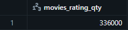

### 2- Qual a nota média geral dos filmes?
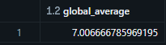

### 3- Qual o filme mais bem avaliado?
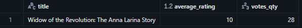

### 4- Qual o filme com maior número de votos?
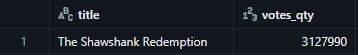

### 5- Quantos filmes têm nota acima de 8?
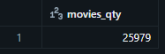

### 6- Quantos filmes têm menos de 100 votos?
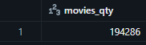

### 7- Qual a distribuição das notas médias?
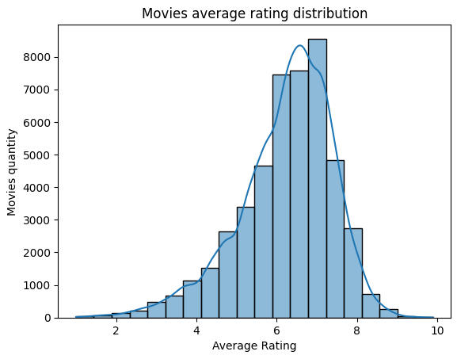

### 8- Top 10 filmes mais bem avaliados (mínimo 1000 votos)
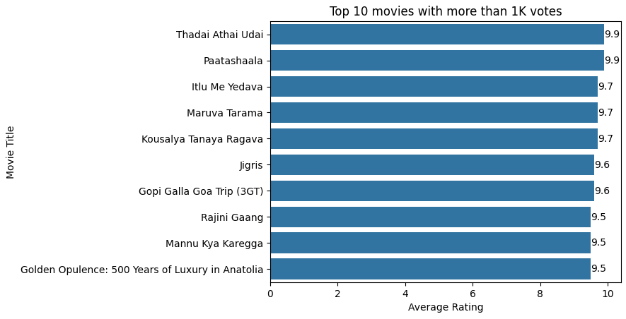

### 9- Top 10 filmes com mais votos
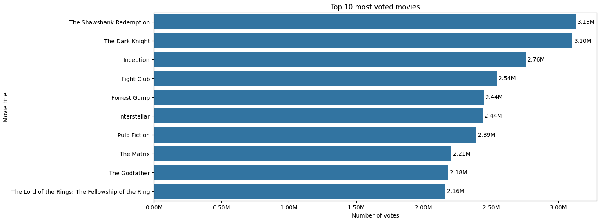

### 10- Filmes “cult”: nota alta, poucos votos
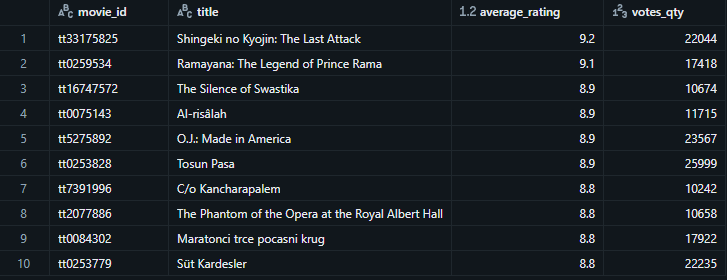

### 11- Filmes “populares”: muitos votos, nota mediana
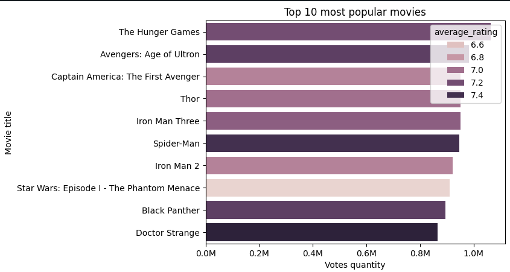

### 12- Quais filmes Christopher Nolan dirigiu?
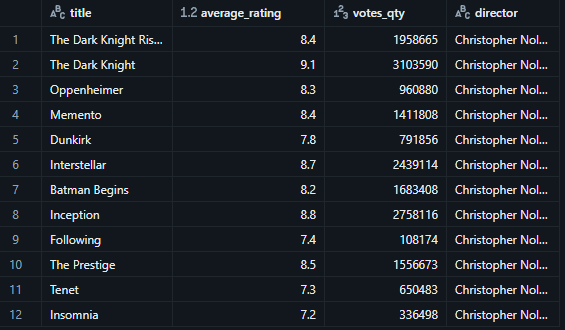

### 13- Quantos filmes cada diretor dirigiu?
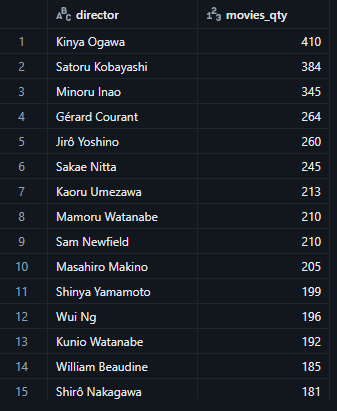

### 14- Quais os 5 filmes mais bem avaliados do Christopher Nolan?
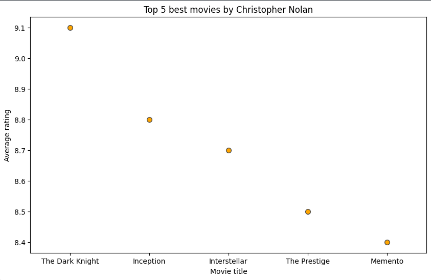